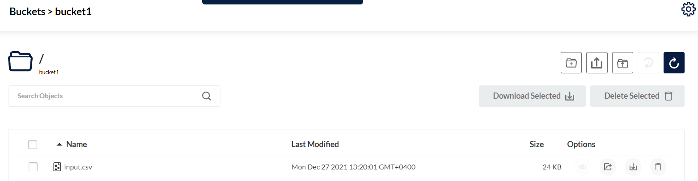
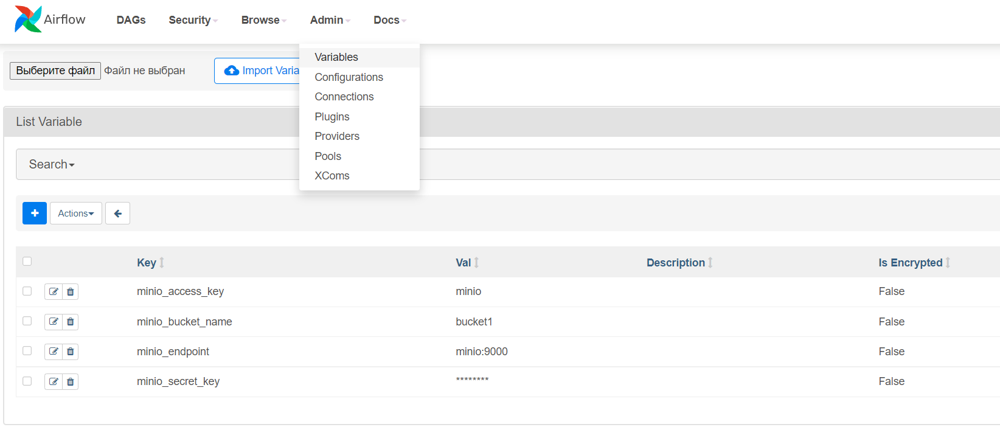

# Структура

+ dags - Папка связаная с контейнером при помощи volume. Именно там создаём DAG's при помощи python
+ data - Папка с примером json файла который будет обработан в даге
+ docker_airflow_settings - Папка где хранится всё необходимое для создания контейнеров
    + airflow.cfg - файл конфигурации для airflow который прикладывается в контейнер
    + docker-compose.yml - обыкновенный компоус файл по которому поднимается ряд контейнеров описанных в нём
    + Dockerfile - основной файл по которому создаётся образ
    + requirements.txt - файл со списком библиотек которые будут загружены в python при его сборке, при необходимости
      просто добавьте нужную, пересобирите контейнер и она будет внутри python. AirFlow не будет ругаться на их
      отсутствие
    + start_docker_image.bat - скрипт запуска контейнеров
+ README.md - Важная информация

# Запуск контейнера

* Перейдите в папку docker_airflow_settings
* Запустите скрипт start_docker_image.bat
* Проверьте что все контейнеры запущены
* Наслаждайтесь

# Дефолтные данные для подключения

+ minio:
    + minio_endpoint - minio:9000
    + minio_access_key - minio
    + minio_secret_key - miniominio
    + minio_bucket_name - bucket1

# Подготовка перед запуском дага

Нужно открыть Minio UI:

*  По ссылке http://localhost:9001/

Авторизоваться:

* Логин - minio_access_key из данных для подключения
* Пароль - minio_secret_key из данных для подключения

После чего создать бакет:

* Его имя - bucket1

И добавить туда файл:

* input.csv из папки data

В итоге получим:

Далее необходимо: 

* Перейти по ссылке http://localhost:8080/
* Перейти во влкадку Admin->Variables
* Создать следующие переменные внутри AirFlow:

После этого можем запускать даг