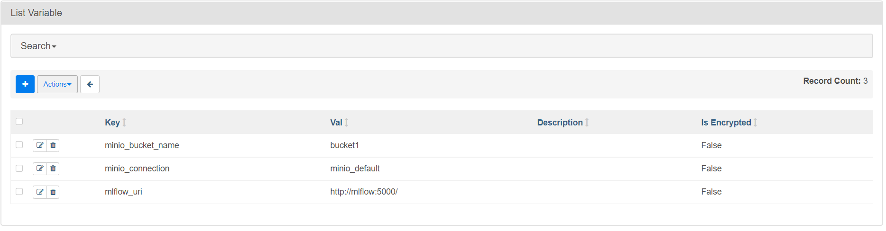

# Структура

+ dags - Папка связанная с контейнером при помощи volume. Именно там создаём DAG's при помощи python
  + models - Папка в которой хранятся модели для MlFlow
  + tasks - Папка в которой содержатся файлы с логикой каждой операции ETL процесса.
  + ETL_Dag.py - Тот самый Dag что будет выполнять ETL_Process

+ data - Папка с примером json файла который будет обрабатываться в DAG
+ docker_flow_settings - Папка где хранится всё необходимое для создания контейнеров
  + airflow
    + airflow.cfg - Файл конфигурации для AirFlow, который прикладывается в контейнер
    + Dockerfile - Основной файл по которому создаётся образ
    + requirements.txt - Список библиотек, которые будут загружены в среду python при сборке контейнера с airflow, при
      необходимости просто добавьте нужную и соберите контейнер и она будет внутри python. AirFlow не будет ругаться на
      их отсутствие.
  + mlflow
    + Dockerfile - Основной файл по которому создаётся образ
    + requirements.txt - Список библиотек, которые будут загружены в среду python при сборке контейнера с airflow, при
      необходимости просто добавьте нужную и соберите контейнер и она будет внутри python. AirFlow не будет ругаться на
      их отсутствие.
    + run_mlflow.sh - Скрипт запуска mlflow server
  + docker-compose.yml - Обыкновенный compose-файл по которому поднимается ряд контейнеров описанных в нём
  + flow.env - файл с переменными среды, которые записываются в систему при сборке контейнера
  + start_docker_image.bat - Скрипт сборки докер контейнеров
+ readme_images - Папка с изображениями из README
+ README.md - Важная информация

# Запуск контейнера

* Перейдите в папку docker_airflow_settings
* Запустите скрипт start_docker_image.bat
* Проверьте что все контейнеры запущены
* Пользуйтесь

# Дефолтные данные для подключения внутри контейнера

+ minio:
    + minio_endpoint - minio:9000
    + minio_access_key - minio
    + minio_secret_key - miniominio
    + minio_bucket_name - bucket1
    + minio_mlflow_bucket_name - mlflow
    + minio_connection - minio_default

# Подготовка перед запуском DAG

## Создаём входные данные в Minio
Нужно открыть Minio UI:

* По ссылке http://localhost:9001/

Авторизоваться:

* Логин - minio_access_key из данных для подключения
* Пароль - minio_secret_key из данных для подключения

Сначала создадим бакет для хранения артефактов MlFlow:

* Он называется - minio_mlflow_bucket_name из данных для подключения

Видя подобный экран:

Нажимаем Create Bucket и наш первый бакет создан.

Теперь создадим бакет в котором будет храниться файл с нашими данными:

* Его имя - minio_bucket_name из данных для подключения

И добавим туда файл:

* input.csv из папки data

В итоге получим:

## Настраиваем окружение AirFlow

* Перейти по ссылке http://localhost:8080/
* Перейти во вкладку Admin->Connection
* 
* Создадим наше подключение к Minio нажав +
* Наше подключение будет выглядеть вот так, имя подключения будет использовано в коде:

  На скриншоте скрыт пароль он должен быть такой же, как в minio_secret_key из данных для подключения
* Сохраним наше подключение

Так же в AirFlow есть прекрасная возможность создавать переменные внутри среды AirFlow:

* Перейти по ссылке http://localhost:8080/
* Перейти во вкладку Admin->Variables
* 
* Создадим следующие переменные внутри AirFlow нажав +:
  
* Это будут переменные с именем бакета - minio_bucket_name и именем нашего подключения minio_connection

После этого можем запускать DAG. 
При успешном выполнении DAG в бакете - bucket1, появится файл output.csv.
Так же в MlFlow по ссылке http://localhost:5000, должен появится эксперимент c именем FIRST_ETL. 
Он выглядит вот так:

Внутри эксперимента можно увидеть различные метрики и теги, которые получились в ходе MlFlow эксперимента.
Так же внутри него лежит артефакт с классическими для MlFlow файлами и обработанным файлом output.csv:

Сам артефакт хранится в Minio в бакете minio_mlflow_bucket_name из данных для подключения:

